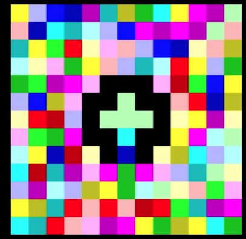

## ➜  ~ whoami

My name is <em><strong>Dmitry</strong></em>, it's pronounced like "D-{{null_sound}}-M-EE-TREE".

I am a product driven, customer obsessed engineering lead with versatile t-shaped skills set who follows lean development approach and who is always here for the team. I advocate for lightweight processes and DevOps paradigm integration into software development cycle to build end-to-end data products. I value personal growth and ambitious strategy the most, and I am always willing to go the extra mile to build best possible solution to satisfy customers.

I'm good at

- focusing on what’s important for customers;
- understanding and scoping business and technical problems;
- challenging status quo;
- bootstrapping end to end data products delivery;
- building teams of high quality engineers and data scientists.

## Get in touch

 

<!--  -->

### Tools I use on daily basis

<table style="border: 0">
    <tr>
        <th>
            
        </th>
    </tr>
    <tr>
        <th>
            
            
            
            
        </th>
    </tr>
    <tr>
        <th>
            
            
            
        </th>
    </tr>
    <tr>
        <th>
            
            
        </th>
    </tr>
    <tr>
        <th>
            
        </th>
    </tr>
    <tr>
        <th>
            
            
            
        </th>
    </tr>
    <tr>
        <th>
            
        </th>
    </tr>
    <tr>
        <th>
            
            
            
            
        </th>
    </tr>
</table>
